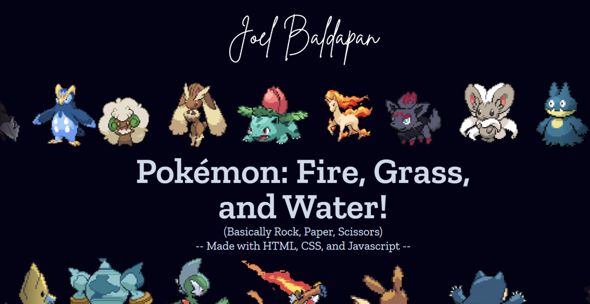

# Pokémon RPS

🔥🌊🌿 **Pokémon RPS** is a web-based Rock-Paper-Scissors game reimagined with Pokémon-style battle mechanics. Play rounds with attack animations, health bars, sound effects, and music—all wrapped in a colorful, responsive UI!

## Demo

[Live Demo](https://github.com/joelbaldapan/pokemon-rps) <!-- Replace with actual demo link if available -->

## Features

- **Pokémon-themed Rock-Paper-Scissors gameplay**
- Animated attack effects and health bars
- Sound effects and background music
- Responsive design for desktop and mobile
- Customizable rounds to win
- Status and feedback messages

## Screenshots



## Getting Started

### Prerequisites

- Modern web browser (Chrome, Firefox, Edge, Safari)

### Installation

1. Clone the repository:
   ```
   git clone https://github.com/joelbaldapan/pokemon-rps.git
   ```
2. Open `index.html` in your browser.

### Folder Structure

```
index.html
README.md
script.js
style.css
audios/
  music/
  sfx/
fonts/
images/
```

- **audios/**: Music and sound effects
- **fonts/**: Custom font(s)
- **images/**: Sprites, backgrounds, icons

## Usage

- Click **START** to begin.
- Choose Fire, Water, or Grass to play a round.
- Watch the battle animations and see who wins!
- Adjust the number of rounds to win using the form.
- Toggle audio with the AUDIO button.

## Technologies Used

- HTML5
- CSS3 (Flexbox, Grid, Animations, Custom Fonts)
- JavaScript (DOM manipulation, event handling, audio control)

## Credits

- Pokémon sprites and sounds are from Generation 5.
- Created by Joel Baldapan for [The Odin Project](https://www.theodinproject.com/).

---

🌐 For The Odin Project Online Course